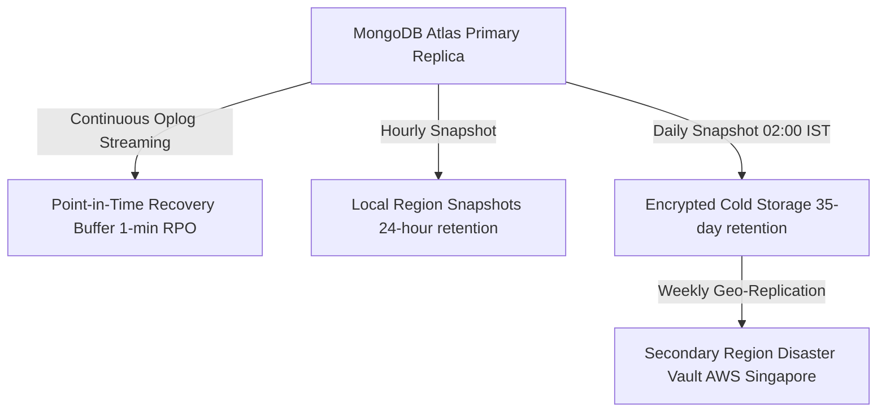

# RideSetu — MongoDB Atlas Database Backup & Disaster Recovery Strategy

This document outlines the backup, retention, and disaster recovery procedures for the **RideSetu** mobility platform database.

---

## 1. Current State vs. Production Scale Roadmap

| Feature | Current Pilot Architecture (M0/M10 Dev) | Recommended Production Scale (M10+ Dedicated) |
| :--- | :--- | :--- |
| **Backup Mechanism** | Automated daily cloud snapshots + manual `mongodump` cron exports | MongoDB Atlas Continuous Cloud Backups (Oplog streaming) |
| **Point-in-Time Recovery (PITR)** | 24-hour snapshot granularity | 1-minute recovery point objective (RPO) over rolling 7–35 days |
| **Snapshot Frequency** | Daily at 02:00 IST | Continuous oplog + hourly local snapshots + daily multi-region copy |
| **Retention Policy** | 7-day rolling window | 35-day daily + 52-week weekly + 12-month annual archive |
| **Cluster Redundancy** | 3-node replica set in AWS Mumbai (`ap-south-1`) | 3-node primary replica set + cross-region DR node in AWS Singapore (`ap-southeast-1`) |

> [!IMPORTANT]
> In the current development and controlled pilot setup, Point-in-Time Recovery (PITR) requires an Atlas M10+ dedicated cluster tier. The local automated test scripts and manual exports serve as pilot redundancy until production provisioning.

---

## 2. Critical Collection Tiering & Recovery Priority

In the event of database restoration, collections are categorized by financial and operational criticality:

### Tier 1: Financial & Transaction Critical (RTO < 15 Minutes)
- `users`: Authentication identities, encrypted driving licence hashes, and verification statuses.
- `bookings`: Active and historical rental agreements, transparent billing breakdowns, and cancellation records.
- `payments`: Razorpay transaction logs, payment signatures, and idempotent refund history.
- `payouts`: Vendor payout ledgers, platform commission deductions, and settlement status.
- `reservationlocks`: Distributed atomic inventory locks preventing double-bookings.
- `disputes`: Damage claims, deposit escrows, and administrative resolutions.
- `kycverifications`: Encrypted document metadata and compliance timestamps.

### Tier 2: Fleet & Marketplace Core (RTO < 30 Minutes)
- `vehicles`: Commercial fleet catalogue, pricing rules, and verification flags.
- `vendors`: Fleet operator profiles, trade licence numbers, and compliance scores.
- `reviews`: Authentic verified customer reviews, sub-category ratings, and vendor responses.
- `notifications`: In-app rider and vendor lifecycle alerts.

### Tier 3: Supporting & Telemetry (RTO < 1 Hour)
- `auditlogs`: Immutable administrative actions and moderation tracking.
- `customersavedlocations`: User hotel and doorstep delivery coordinates.
- `supporttickets`: Roadside assistance logs and general inquiries.

---

## 3. Recommended Automated Backup Schedule



1. **Hourly Local Snapshots**: Kept for 24 hours for fast operational rollback during deployment anomalies.
2. **Daily Snapshots (02:00 IST)**: Encrypted at rest using AES-256 and retained for 35 days.
3. **Weekly Long-Term Archives**: Transferred to a secondary geographical region (AWS Singapore) for catastrophic cloud failure resilience.

---

## 4. Manual Export Script for Pilot Staging

For controlled pilot environments, automated export scripts using `mongodump` can be run via scheduled crons:

```bash
# Secure, gzip-compressed snapshot export with timestamp
TIMESTAMP=$(date +"%Y%m%d_%H%M%S")
mongodump --uri="$MONGODB_URI" --gzip --archive="./backups/ridesetu_backup_${TIMESTAMP}.archive"

# Verification of archive integrity
mongorestore --archive="./backups/ridesetu_backup_${TIMESTAMP}.archive" --dryRun
```

---

## 5. Disaster Recovery Runbook

### Step 1: Incident Assessment & Cluster Isolation
- If data corruption or ransomware is detected, immediately terminate active client connection pools.
- Put the web application into maintenance mode (`NEXT_PUBLIC_MAINTENANCE=true`).

### Step 2: Atlas Point-in-Time Restore (PITR)
1. Navigate to **MongoDB Atlas Console** → **Database Deployments** → **Backup**.
2. Select **Restore** → **Point-in-Time**.
3. Choose the exact timestamp prior to the corruption event (e.g., `2026-08-19 14:45:00 UTC`).
4. Restore to a new dedicated target cluster (to preserve original logs for forensic audit).

### Step 3: Connection String & Secret Rotation
- Update application environment variable `MONGODB_URI` with the restored cluster endpoint.
- Restart the Next.js server instances.

### Step 4: Data Consistency & Integrity Check
Run the automated RideSetu integrity test suite:
```bash
npm run test:availability
npm run test:e2e
```

### Step 5: Resume Traffic
- Lift maintenance mode and verify live vehicle search and booking confirmations.
