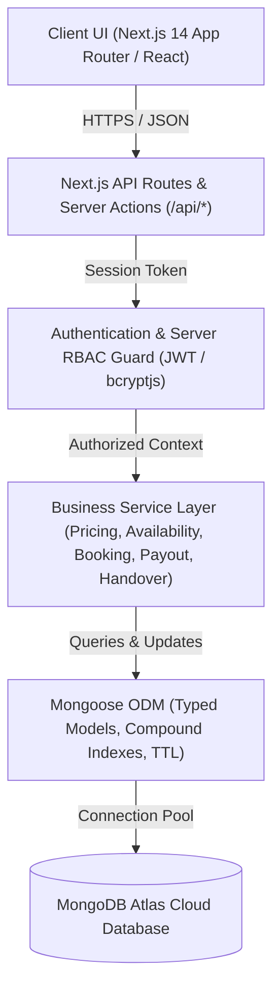

# RideSetu

**One Place. Every Ride. Every Destination.**

[](https://nextjs.org/)
[](https://react.dev/)
[](https://www.typescriptlang.org/)
[](https://www.mongodb.com/atlas)
[](https://tailwindcss.com/)
[](#disclaimer)

---

## Overview

**RideSetu** is a multi-vendor travel mobility marketplace where tourists and travellers can discover, compare, and book verified rental two-wheelers and cars from licensed local rental operators. 

Traditional vehicle rentals in tourist hubs suffer from fragmented pricing, unverified fleet conditions, arbitrary security deposit withholdings, and sudden overbooking. RideSetu solves this by bringing independent local operators into a unified, transparent digital marketplace featuring side-by-side vehicle comparison, cryptographic double-booking prevention, 360° digital vehicle handover reports, and protected security deposit isolation.

### Initial Launch Destinations (Uttarakhand)
- 🌊 **Rishikesh** (Tapovan, Laxman Jhula, Railway Station)
- 🏔️ **Mussoorie** (Mall Road, Picture Palace, Library Chowk)
- 🌲 **Dehradun** (ISBT, Railway Station, Jolly Grant Airport)
- 🛕 **Haridwar** (Har Ki Pauri, Railway Station)
- ⛵ **Nainital** (Mallital, Tallital, Nainital Lake)
- 🚂 **Haldwani** (Kathgodam Station, Bus Station)

---

## Key Features

### 👤 Customer Features
- **Destination-Based Vehicle Search**: Instant search by city, pickup hub, vehicle category, and exact pickup/return date-time timestamps.
- **Scooter / Bike / Car Rentals**: Wide category coverage from commuter scooters (Activa 6G, Jupiter) and touring motorcycles (Royal Enfield Classic 350, Himalayan) to self-drive cars and EVs.
- **Multi-Vendor Comparison**: Compare up to 4 vehicles simultaneously across daily rates, refundable deposits, KM limits, excess KM fees, delivery options, and included amenities.
- **Dynamic Vehicle Filters**: Refine listings by transmission (Automatic/Manual), brand, price range, helmet inclusion, free cancellation, roadside assistance, and customer ratings.
- **Transparent Checkout**: Detailed price breakdown isolating base rental, hotel delivery, platform convenience fee, GST (18%), discount coupons, and **100% Refundable Security Deposit**.
- **Digital KYC Workflow**: In-checkout Aadhaar and Driving License upload with status tracking.
- **Promo Coupons**: Server-validated discount coupon engine (e.g., `RISHIKESH100`, `FIRST10`, `SETU200`).
- **Wishlist & Favorites**: Save desired rides for upcoming itineraries.
- **Digital Booking Voucher**: Instant confirmation card with QR code verification, pickup instructions, and emergency contact details.
- **Active Ride Companion**: Real-time trip dashboard during active rentals with 24/7 SOS Roadside Assistance, one-click vendor hotline, and digital inspection certs.
- **Rental Extension**: Mid-trip duration extension with server-side future slot conflict checking.
- **Multi-Criteria Reviews**: Verified post-ride reviews scoring vehicle condition, vendor behavior, pickup experience, and value for money.

### 🏢 Vendor Features
- **Vendor Onboarding**: Self-service registration with commercial rental license, GST registration, business address, and bank account setup.
- **Fleet Listing Management**: Create, edit, and manage listings with photo uploads, registration numbers, manufacturing year, fuel type, and pricing tiers.
- **Pricing & Deposit Controls**: Set weekday/weekend rates, custom refundable deposits, excess KM rates, and hotel delivery radiuses/fees.
- **Availability Calendar**: Visual calendar to view confirmed bookings and manually block dates for routine maintenance or private usage.
- **Booking Management**: View incoming, confirmed, active, and completed rentals with instant customer contact.
- **Digital Handover Tool**: Perform pre-pickup 360° photo capture, record odometer/fuel levels, and mark existing scratches on an interactive body diagram.
- **Payout Dashboard**: Automated gross-to-net payout calculation with commission transparency (15% platform take-rate) and settlement tracking.
- **Performance Analytics**: Track utilization rate, average rental duration, fleet earnings, and customer ratings.

### 🛡️ Admin Features
- **Vendor Compliance Verification**: Review and approve/reject vendor trade licenses, GST certificates, and physical hub locations.
- **Vehicle Compliance Verification**: Validate vehicle RC, commercial insurance, and fitness certificates before marketplace listing.
- **Central Booking Oversight**: Global visibility over all platform bookings, transitions, and cancellations.
- **Dynamic Commission Management**: Configure global or vendor-specific platform commission rates (e.g., 10% to 15%).
- **Dispute Arbitration Console**: Review digital handover diffs (before vs. after damage photos, fuel logs, odometer delta) to impartially arbitrate security deposit deductions and customer refunds.
- **Coupon Management**: Create and schedule promotional campaigns with min-spend rules and expiration dates.
- **Support Desk**: Manage customer and vendor support tickets with status workflows.
- **GMV & Platform Analytics**: Real-time Gross Merchandise Value (GMV), net platform revenue, active fleet count, and destination demand breakdown.

---

## Trust & Safety

```
┌─────────────────┐       ┌─────────────────┐       ┌─────────────────┐
│ Verified Vendor │ ───>  │ Digital Handover│  ───> │ Deposit Vault   │
│ & Fleet RC/DL   │       │ Pre-Ride 360°   │       │ Isolated Hold   │
└─────────────────┘       └─────────────────┘       └─────────────────┘
                                   │
                                   ▼
┌─────────────────┐       ┌─────────────────┐       ┌─────────────────┐
│ Dispute Board   │ <───  │ Return Check-In │ <───  │ 24/7 Roadside   │
│ Photo Evidence  │       │ Auto-Diff Calc  │       │ SOS Assistance  │
└─────────────────┘       └─────────────────┘       └─────────────────┘
```

- **Verified Vendors & Fleets**: Strict verification of vendor trade licenses and commercial vehicle fitness certificates.
- **Digital Handover Protocol**: 360° vehicle photography, fuel gauge recording, odometer logging, and scratch marker pinboard prior to key handover.
- **Return Inspection & Diff Engine**: Automated difference calculation on return (excess KM calculation, fuel top-up discrepancies, new scratch detection).
- **Security Deposit Protection**: Refundable security deposits are held in a separate accounting ledger and are never treated as platform revenue.
- **Damage Claim & Dispute Arbitration**: Vendors cannot unilaterally seize deposits; disputes require photographic evidence reviewed by RideSetu administrators.
- **Server-Side RBAC**: Role-based access control (`CUSTOMER`, `VENDOR`, `ADMIN`) validated on every API endpoint and server action.
- **Double-Booking Prevention**: Server-side overlapping interval detection prevents concurrent reservations for the same physical vehicle.

---

## Tech Stack

| Layer | Technology | Purpose |
| :--- | :--- | :--- |
| **Frontend** | **Next.js 14 (App Router)** | Server & Client components, SSR, Dynamic Routing |
| **UI & Styling** | **Tailwind CSS + Vanilla CSS** | Responsive styling, fluid layouts, custom tokens |
| **Icons & Assets** | **Lucide React** | Clean, accessible vector icons |
| **Backend** | **Next.js Route Handlers / Server Actions** | REST APIs, business service layer, validation |
| **Runtime** | **Node.js** | Server-side execution environment |
| **Database** | **MongoDB Atlas** | Primary cloud document database |
| **ODM** | **Mongoose** | Typed document schemas, validation, compound indexes |
| **Authentication** | **JWT + bcryptjs** | HTTP-only cookie sessions, salted password hashing |
| **Payments** | **Razorpay Sandbox Architecture** | Order generation, HMAC-SHA256 signature verification (Mock/Sandbox ready) |
| **Storage** | **Storage Service Abstraction** | Public listings & private KYC/handover document ACLs (Cloudinary / Local fallback) |
| **Image Pipeline** | **Next.js `next/image`** | Optimized AVIF/WebP image rendering & CWV compliance |

---

## Architecture



---

## Booking Architecture & Double-Booking Prevention

RideSetu implements a mathematical overlap condition at the database layer with exact timestamp precision (`pickupDateTime`, `returnDateTime`):

$$\text{requestedPickup} < \text{existingReturn} \quad \land \quad \text{requestedReturn} > \text{existingPickup}$$

```
Existing Booking:         [======== 18 Aug 10:00 to 20 Aug 18:00 ========]
Overlapping Attempt A:         [---- 19 Aug 10:00 to 21 Aug 18:00 ----]      --> ❌ 409 CONFLICT
Overlapping Attempt B:   [---- 17 Aug 10:00 to 19 Aug 10:00 ----]            --> ❌ 409 CONFLICT
Enclosed Attempt C:            [---- 18 Aug 12:00 to 19 Aug 12:00 ----]      --> ❌ 409 CONFLICT
Consecutive Booking D:                                                    [== 20 Aug 18:00 to 22 Aug 18:00 ==] --> ✅ ALLOWED
Prior Slot Booking E:    [== 16 Aug 10:00 to 18 Aug 10:00 ==]                                                  --> ✅ ALLOWED
```

### Distributed Database-Backed Reservation Hold
1. When checkout starts, a temporary `ReservationLock` document is created in MongoDB Atlas.
2. The lock has a **10-minute TTL index** (`expires: '10m'`) that auto-releases the hold if checkout is abandoned.
3. If concurrent requests arrive across multi-instance or serverless workers, MongoDB Atlas arbitrates the hold; exactly **1** attempt succeeds and all conflicting attempts safely receive a `409 Conflict` response.
4. Upon successful payment verification, the reservation lock is atomically transitioned to `CONFIRMED` in the primary `Booking` collection.

---

## Testing & Verification Results

All core marketplace modules, calculations, and security guards are backed by automated test suites:

| Suite / Verification Area | Test Metric | Result | Status |
| :--- | :--- | :---: | :---: |
| **Availability & Pricing Engine** | Duration, delivery fee, GST, deposit isolation, overlap checks | **19 / 19 Assertions** | ✅ PASS |
| **End-to-End Application Flow** | Auth, search, compare, checkout, handover diff, payouts, disputes | **41 / 41 Assertions** | ✅ PASS |
| **Concurrency Stress Test** | 25-thread simultaneous parallel requests for identical vehicle/slot | **1 Confirmed, 24 Rejected** | ✅ PASS |
| **Browser Functional Routes** | Customer, Vendor, Admin, Compare, City SEO, Dynamic APIs | **27 / 27 Routes** | ✅ PASS |
| **Next.js Production Build** | Full static and dynamic route compilation | **0 Errors** | ✅ PASS |
| **ESLint Quality & Image Check** | Core Web Vitals, TypeScript types, Next Image optimization | **0 Errors / 0 Warnings** | ✅ PASS |

> *Note: Tests distinguish specific logical assertions from end-to-end user scenarios.*

---

## Demo Accounts

The application includes pre-seeded demo accounts for development and evaluator testing.

> ⚠️ **DEVELOPMENT ONLY**: These accounts are provided strictly for local demonstration and evaluation.

| Role | Email | Password | Access / Capabilities |
| :--- | :--- | :--- | :--- |
| **Customer** | `customer@ridesetu.demo` | `customer123` | Search, compare, book, view active ride companion, KYC flow |
| **Vendor** | `vendor@ridesetu.demo` | `vendor123` | Fleet management, calendar blocker, digital handover, payouts |
| **Admin** | `admin@ridesetu.demo` | `admin123` | Master control console, vendor/vehicle verification, dispute resolution |

> ⚡ **Quick Role Switcher**: A 1-click role bar is available at the top of the interface in development mode to switch personas instantly without manual login.

---

## Environment Variables

Copy `.env.example` to `.env.local` to configure your environment.

```bash
# ==============================================================================
# RideSetu — Environment Configuration Template (.env.example)
# ==============================================================================

# MongoDB Atlas Connection URI (Server-side only)
MONGODB_URI=mongodb+srv://<username>:<password>@<cluster>.mongodb.net/ridesetu?retryWrites=true&w=majority

# JWT Authentication Secret
JWT_SECRET=your_super_secret_jwt_key_minimum_32_characters

# Application Base URL
NEXT_PUBLIC_APP_URL=http://localhost:3000

# Razorpay Sandbox Credentials (Server-side only)
RAZORPAY_KEY_ID=rzp_test_placeholder_key_id
RAZORPAY_KEY_SECRET=rzp_test_placeholder_key_secret

# Cloudinary Storage Configuration (Optional / Server-side only)
CLOUDINARY_CLOUD_NAME=your_cloud_name
CLOUDINARY_API_KEY=your_api_key
CLOUDINARY_API_SECRET=your_api_secret

# Notification Provider Keys (Optional / Server-side only)
SENDGRID_API_KEY=
TWILIO_ACCOUNT_SID=
TWILIO_AUTH_TOKEN=
TWILIO_PHONE_NUMBER=
WHATSAPP_API_TOKEN=
WHATSAPP_PHONE_NUMBER_ID=
```

> 🔒 **Security Notice**: Never commit `.env.local` or expose `MONGODB_URI`, `JWT_SECRET`, or payment secrets to client-side code.

---

## Local Setup

### Prerequisites
- **Node.js**: v18.17.0 or later
- **npm**: v9.0.0 or later
- **MongoDB Atlas**: Free M0 Sandbox cluster or local MongoDB instance

### 1. Clone the Repository
```bash
git clone https://github.com/your-username/ridesetu.git
cd ridesetu
```

### 2. Install Dependencies
```bash
npm install
```

### 3. Configure Environment
```bash
cp .env.example .env.local
# Open .env.local and set your MONGODB_URI and JWT_SECRET
```

### 4. Seed the Database
Populate MongoDB Atlas with Uttarakhand destinations (Rishikesh, Mussoorie, Dehradun, Nainital, Haridwar, Haldwani), verified vendors, 30+ vehicles, reviews, and demo coupons:
```bash
npm run db:seed
```

### 5. Run Verification Test Suites
```bash
# Run core availability & pricing tests
npm run test:availability

# Run full end-to-end integration tests
npm run test:e2e
```

### 6. Start Development Server
```bash
npm run dev
```
Open [http://localhost:3000](http://localhost:3000) in your browser.

---

## Project Structure

```
ridesetu/
├── .env.example                        # Environment variable template
├── .env.local                          # Local credentials (gitignored)
├── next.config.mjs                     # Next.js config with remote image domains
├── package.json                        # Scripts and dependencies
├── tsconfig.json                       # TypeScript compiler options
├── docs/
│   └── screenshots/                    # UI mockups and documentation assets
├── src/
│   ├── lib/
│   │   ├── mongodb.ts                  # Cached MongoDB Atlas connection pool
│   │   ├── auth.ts                     # JWT signing, verification, and RBAC assertion
│   │   ├── rate-limit.ts               # Token-bucket API rate limiter
│   │   └── utils.ts                    # Currency formatting and duration helpers
│   ├── models/                         # 18+ Typed Mongoose Schemas
│   │   ├── User.ts                     # Customer, Vendor, Admin accounts & KYC
│   │   ├── Vendor.ts                   # Business profile, trade license, commission
│   │   ├── Destination.ts              # Travel destinations, tips, and guidelines
│   │   ├── PickupLocation.ts           # City pickup hubs and transit points
│   │   ├── Vehicle.ts                  # Fleet specs, category, deposit, KM limits
│   │   ├── VehicleAvailability.ts      # Blocked dates and maintenance schedules
│   │   ├── ReservationLock.ts          # Distributed reservation locks with TTL
│   │   ├── Booking.ts                  # Exact-timestamp bookings and financial records
│   │   ├── DigitalHandoverReport.ts    # 360° inspection, fuel %, odometer, scratch pins
│   │   ├── Dispute.ts                  # Damage claims and admin arbitration records
│   │   ├── Payment.ts & Payout.ts      # Transaction records and vendor settlements
│   │   ├── Review.ts                   # Multi-criteria ratings and reviews
│   │   └── Coupon.ts                   # Promotional discount rules
│   ├── services/                       # Business Logic Layer
│   │   ├── pricing.service.ts          # Itemized pricing & deposit calculation
│   │   ├── availability.service.ts     # Overlap detection & distributed locking
│   │   ├── booking.service.ts          # Booking lifecycle state machine
│   │   ├── payment.service.ts          # Razorpay order generation & HMAC signature verification
│   │   ├── storage.service.ts          # Public vs. private file storage abstraction
│   │   ├── notification.service.ts     # Multi-channel notification dispatcher
│   │   ├── handover.service.ts         # Digital inspection diff analysis
│   │   └── payout.service.ts           # Vendor payout and commission calculations
│   ├── components/
│   │   ├── common/                     # DemoRoleBar, Navbar, Footer, AuthModal
│   │   ├── marketplace/                # SearchWidget, VehicleCard, FilterSidebar, CompareTable
│   │   ├── booking/                    # PriceBreakdownCard, PaymentModal, BookingVoucherCard
│   │   └── handover/                   # DigitalInspectionModal
│   ├── app/
│   │   ├── page.tsx                    # Marketplace Homepage
│   │   ├── vehicles/                   # Vehicle Catalog & Detail Pages
│   │   ├── compare/                    # 4-Way Vehicle Comparison Matrix
│   │   ├── book/[vehicleId]/           # Multi-Step Checkout & KYC Upload
│   │   ├── destinations/[slug]/        # SEO Travel Guides
│   │   ├── dashboard/                  # Live Active Ride Companion & History
│   │   ├── vendor/                     # Vendor Fleet Portal & Calendar Blocker
│   │   ├── admin/                      # Super Admin Console & Dispute Board
│   │   ├── bike-rental/[city]/         # Programmatic City Bike Pages
│   │   ├── scooty-rental/[city]/       # Programmatic City Scooty Pages
│   │   ├── car-rental/[city]/          # Programmatic City Car Pages
│   │   └── api/                        # 21 Secure REST API Route Handlers
│   └── scripts/
│       ├── seed.ts                     # Database seeding script
│       ├── test-connection.ts          # MongoDB Atlas connection check
│       ├── test-availability.ts        # Architecture logic test suite
│       ├── test-concurrency.ts         # Multi-thread concurrency stress test
│       └── verify-e2e.ts               # Full E2E application verification suite
```

---

## Screenshots

<!-- Add interface screenshots below once rendered in your environment -->

| Marketplace Homepage | Vehicle Comparison Matrix |
| :---: | :---: |
|  |  |

| Vendor SaaS Portal & Calendar | Admin Control & Dispute Center |
| :---: | :---: |
|  |  |

---

## Roadmap

- [ ] **Razorpay Production Account Activation**: Enable live Card, NetBanking, and UPI auto-settlement workflows.
- [ ] **Direct Cloudinary / AWS S3 Uploads**: Enable direct presigned client uploads for large inspection videos.
- [ ] **External Notification Gateways**: Connect live SendGrid, Twilio, and WhatsApp Business API credentials.
- [ ] **Govt ID & Driving License OCR Verification**: Integrate automated Digilocker / HyperVerge KYC verification.
- [ ] **Mapbox / Google Maps Fleet Telematics**: Live GPS tracking, geofencing, and pickup hub navigation.
- [ ] **Vendor Network Expansion**: Onboard 100+ local rental operators across Uttarakhand (Rishikesh, Mussoorie, Dehradun, Nainital).
- [ ] **Pan-India Expansion**: Extend to Himachal Pradesh (Manali, Kasol, Dharamshala), Goa, Rajasthan (Jaipur, Udaipur), Pondicherry, and Leh-Ladakh.

---

## Disclaimer

This repository is currently a **Startup MVP / Academic & Technical Demonstration Project**. Launching RideSetu for commercial passenger vehicle rentals in India requires complete validation with all applicable statutory regulations, including:
- Uttarakhand Motor Vehicles Rules and the *Rent a Motor Cycle Scheme, 1997*.
- Commercial vehicle trade permits, yellow-plate registration, and comprehensive passenger rental insurance.
- Official RBI/PA guidelines for customer security deposit escrow and payment aggregator processing.
- State-specific transport department and police tourist verification mandates.
